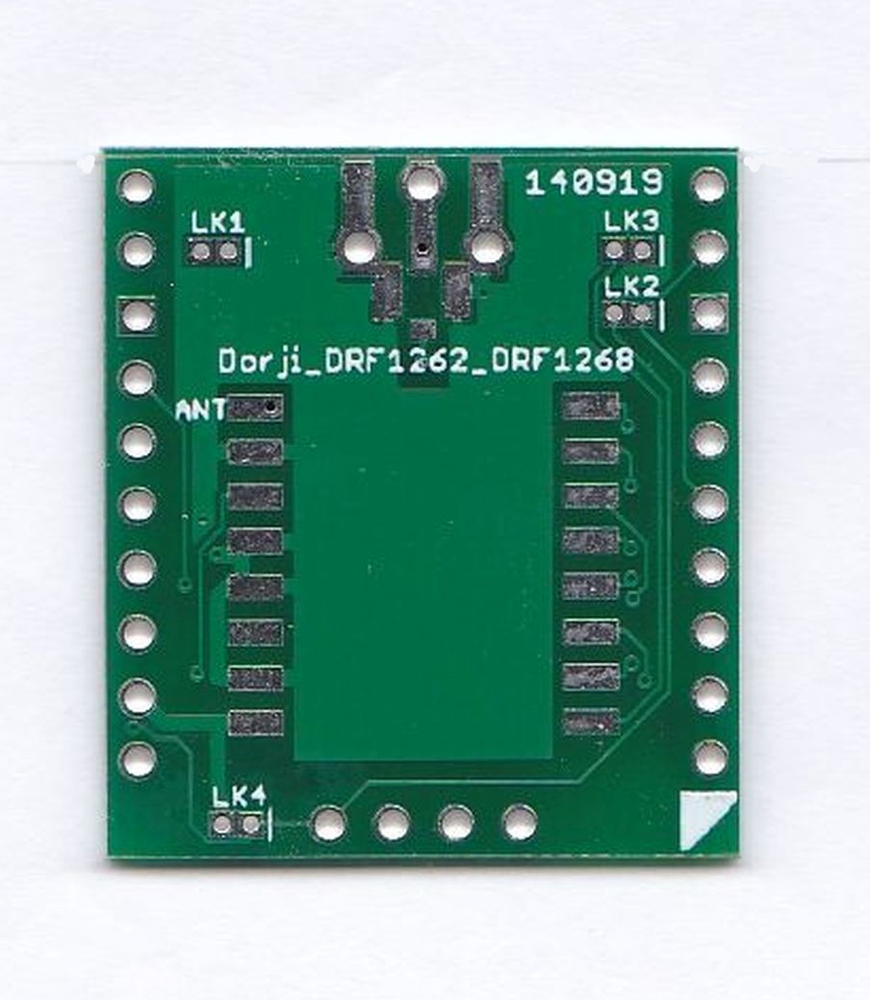
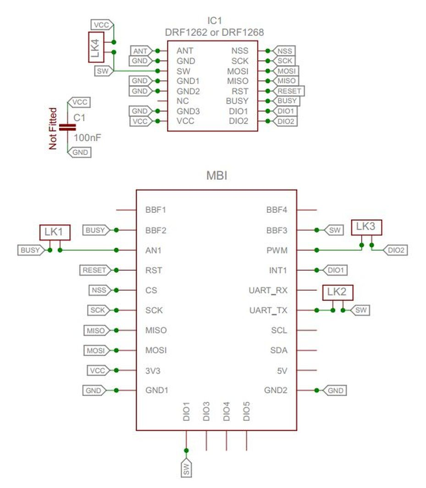

### Breadboard Friendly Dorji SX1262 SX1268 Board

This is a board to adapt your  Dorji SX1262 or SX1268 LoRa® module into a breadboard friendly format. The board will allow you to use the SX1262 or SX1268 with a standard 0.1” matrix breadboard or stripboards. This is a board only, the SX1262 or SX1268 module is not supplied.

The antenna connection can be either  a simple wire, U.FL connector or an edge SMA socket. The boards are supplied with the 0.1" pins un-soldered, leaving you the option of how to assemble or use the board in a project. 
This board can be used with the  Easy mikroBUS™ Pro Mini controller available in this shop. 

The Dorji SX1262 or SX1268 module is fitted with a TCXO which means that you can use LoRa® at the low bandwidths such as 7.8khz, this is far lower than 62.5khz which tends to be the limit for the SX127x style LoRa® devices. The TCXO also means that when sending FSK RTTY, as used in high altitude balloon tracking, there is less heating induced frequency drift.

**Do not operate the SX1262 or SX1268 module without an antenna.** 

**The SX1262 and SX1268 is a 3.3V supply and logic level device, do not use directly with 5V controller boards such as the Arduino UNO.** 

There are many examples for using this module for GPS trackers or sensors provided in an Arduino library at this link;  **[SX12XX Library](https://github.com/StuartsProjects/SX12XX-LoRa)**

The pin out of the board is below, the LoRa® device pin names on the outside.

Various options have been added to the board. If you are using the board with the **[Easy Pro Mini](https://www.tindie.com/products/20845/)** product available in the store then you can use the board as is. If you want to use the board in some other mikroBUS™ compatible controller, then you will need to make some links since the mikroBUS™ standard only has two rows of 8 pins and as well has having DIO1,DIO2 and DIO3 pins there are BUSY and RW pins needed as well. The controller would have to have an analogue pin connected to AN1 that can be set in digital mode, a lot can fortunately. LK1 can then be used to connect the SX1262 or SX1268 modules BUSY pin. You would also need to connect the SW pin to UARTTX on the Mikrobus socket so that the microcontroller can access the SX1262 or SX1268 modules RW pin.  