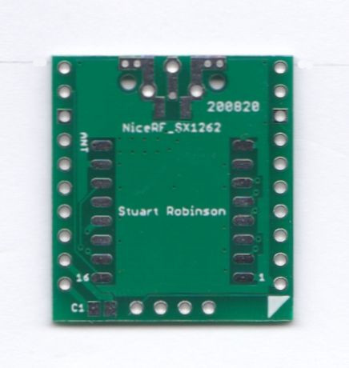

### Breadboard Friendly NiceRF SX1262 Board

This is a board to adapt your NiceRF SX1262 LoRa® module into a breadboard friendly format. The board will allow you to use the SX1262 with a standard 0.1” matrix breadboard or stripboards. This is a board only, the SX1262 module is not supplied.

The antenna connection can be either  a simple wire, U.FL connector or an edge SMA socket. The boards are supplied with the 0.1" pins un-soldered, leaving you the option of how to assemble or use the board in a project. 
This board can be used with the  Easy mikroBUS™ Pro Mini controller available in this shop. 

The NiceRF SX1262 module is fitted with a TCXO which means that you can use LoRa® at the low bandwidths such as 7.8khz, this is far lower than 62.5khz which tends to be the limit for the SX127x style LoRa® devices. 

**Do not operate the SX1262 module without an antenna.** 

**The SX1262 is a 3.3V supply and logic level device, do not use directly with 5V controller boards such as the Arduino UNO.** 

There are many examples for using this module for GPS trackers or sensors provided in an Arduino library at this link;  [SX12XX Library](https://github.com/StuartsProjects/SX12XX-LoRa)

The pin out of the board is below, the lora device pin names on the outside.

https://github.com/StuartsProjects/Devices/tree/master/Breadboard%20Friendly%20DRF1278%20Board