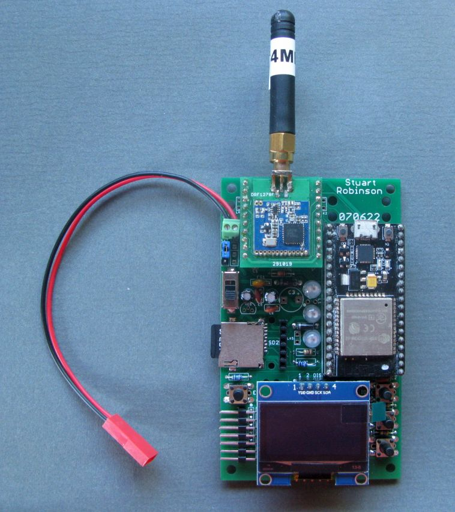
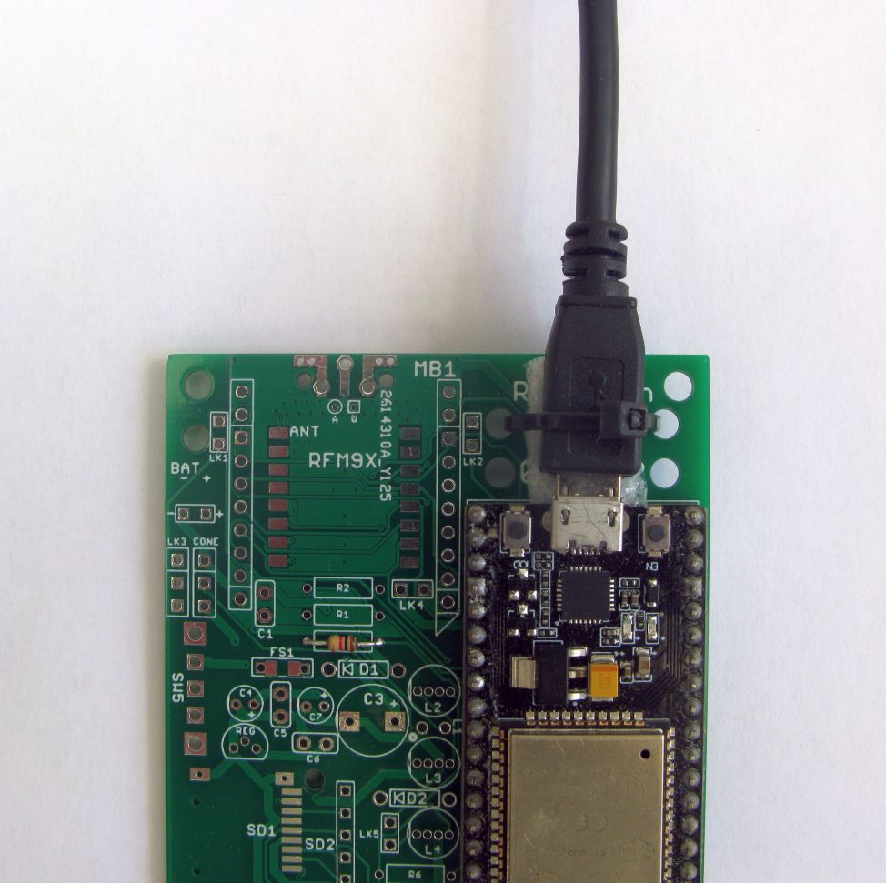
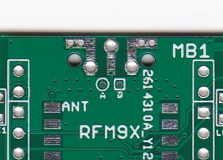
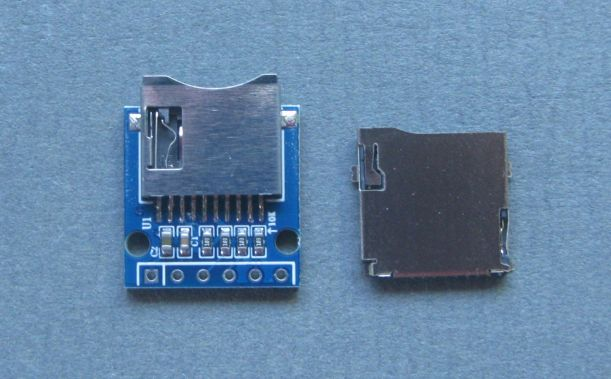
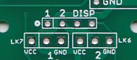
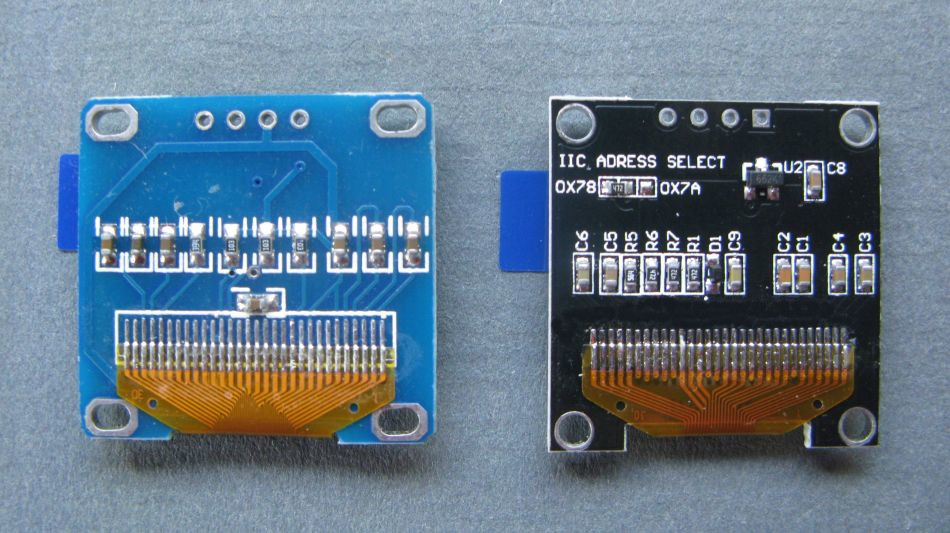
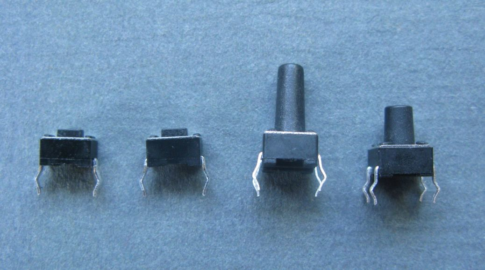

# EasyBuild ESP32 Board

This is a repository for the schematics and board files for an easy build portable hand held or bench based LoRa receiver that has enough resources to be used for receiving files and images over LoRa.

The board was described in this post;

[**https://stuartsprojects.github.io/2022/08/06/EasyBuild-ESP32-Board.html**](https://stuartsprojects.github.io/2022/08/06/EasyBuild-ESP32-Board.html)

The board can be built with through hole components only, although there is the option of adding a surface mount SD card holder and a 2Kbyte or 8Kbyte FRAM. 

The micro controller used was the NodeMCU ESP32, this has plenty of memory, is ready built and low cost.

 

  

 

The NodeMCU is offset from the top of the board for a reason. One significant concern for a bench or hand held device was leaving the somewhat fragile USB connection permanently connected. I have lost modules because after a while the USB PCB connector can snap off. So for this board I arranged it so that the USB cable could be secured to the board with a spacer and a tie wrap, see the idea below;

 

  

 
 

You don't have to secure the USB cable this way, but if your using the board in portable mode and powering it with a USB power bank plugged into the NodeMCU, then securing the USB cable might be a good idea. Think what might happen if you drop the power bank.

The board has connectors for;

1. Mikrobus compatible plug in boards, such as LoRa modules.
1. 128x64 OLED display.
1. External Battery pack with power switch.
1. 3 off WS2811 NeoPixel LEDs.
1. 3 off push button switches.
1. 2Kbyte or 8Kbyte FRAM.  
1. I2C external sensors.
1. I2C MPR121 3X4 Touch Keypad.
1. External GPS.
1. USB to Serial adapter for serial file uploads to a PC.
1. Bare RFM9x or SX1280 LoRa modules.
  

##Direct fit of RFM9x or SX1280 LoRa devices. 

This first off design of the EasyBuildESP32 has the SMT pads to accept an RFM9x LoRa device direct on the front side and a NiceRF SX1280 (2.4Ghz) LoRa device on the rear. There are connections for an edge SMA antenna socket or a simple wire antenna. 

To enable both devices to share the same antenna socket there is a track to be cut depending on which module you have. If you are using an RFM9x then cut the track at 'B' which is a square pad near the centre of the SMA antenna socket. The easiest way to cut the track is to drill a hole (about 1mm diameter) at point 'B'. If your fitting a SX1280 on the board rear, then cut the track at point 'A' which is the round pad, again the easiest way to do this is to drill a 1mm hole. 

 

  

 

#### microSD card holders

Please note that for the microSD card holders, a holder that is designed for use on 5V logic level Arduinos **should not be used on this board** it will mess up the SPI (Serial Peripheral Interface) bus. Use a microSD card holder type that has no regulator or logic level converters. The microSD card holders I used for the EasyBuildESP32 are pictured below, pin in hole type on the left, SMT type on the right;

 

  

 

The microSD card is used on the EasyBuildESP32 in MMC (Multi Media Card)mode. This uses a separate interface on the ESP32 that is dedicated to driving a microSD card in MMC mode. The SD card card could have been driven in SPI mode and then it would share pins with the LoRa device which also runs in SPI mode. However whilst sharing the SPI bus between SD cards and LoRa devices works reliably on some Arduino cores, such as the Arduino DUE and the cores for ATmega328P and ATmega1284P, its not very reliable on the ESP32, after some time the microSD card stops responding. 

Driving the microSD card in MMC mode seems to be a lot more reliable.

Please note that its very likely that you wont be able to upload programs to the NodeMCU if there is an SD card in the slot, since the presence of a card impacts the logic level on pin GPIO2. 

#### OLED display connections. 

The I2C (Inter integrated circuit) OLED displays can use different connections for VDD and GND. See the PCB connections for 'DISP' below. Some displays will be connected, left to right GND,VCC,SCL,SDA and some displays will be VCC,GND,SCL,SDA. 

 

  

 

LK7 allows you to select VCC or GND for pin 1 of the DISP connector. LK6 allows you to select VCC or GND for pin 2 of the DISP connector. Make the links and then check with a multimeter that the polarity of the voltage on pins 1 and 2 of the DISP connector are correct for your display. 

Note that the NodeMCU is 3.3V logic level and supply, so use the correct version of the OLED, some are for 5V operation. In the picture below the left display is for 3.3V operation, so the one you need, the display on the right is a 5V display and is not the right type for this board, it might not work very well. Note that 5V type has a small regulator fitted, its marked U2 on the right display. 

 

  

 

#### Switches

There are 4 sets of push button switches used, SW1 to SW4. There is the option of fitting the type of push button that comes in different button lengths (the SWxB parts), or you can use the small rectangular low profile type (the SWxA parts), your choice. See picture A type switches on the left, B type switches on the right.

 

  

 

#### Resistors 

There are a number of resistor pull ups that can be fitted for the MMC_SD pins. In most cases they are not needed but they were designed into place on a just in case basis. In the list of parts below if a resistor is normally not needed then its mentioned. 

Use standard, easy to get, 1/4 watt resistors or the smaller 1/6 watt or 1/8 watt types.

#### Part voltage ratings.

The maximum voltage for an external supply is likely going to be 7.5V, from 5 Alkaline batteries. Thus capacitors and other components should have a voltage rating of 10V or higher. 

## List of parts

1. ANT1  SMA edge socket If you fitted an RFM9X or SX1280 direct to the PCB then this is the socket for the antenna, or you can solder a wire direct to the centre pin. Not needed if your using a plug in Mikrobus type LoRa board.
  
1. BAT  SCREWTERMINAL 2WAY 0.1 inch, for the external battery. Use the screw terminal if you have one or a 0.1" angled header or solder wires direct.
     
1. BATHOLDER  AA_X_5_DEFAULT The battery holder that can be stuck on the back of the PCB. Four AA Alkalines is a marginal supply for the board. When the batteries are new then you have a 6V supply. But around 50% of the way through the battery life the supply will start going below 4.8V. Five AA alkalines, or NiMh rechargeables might be a better choice.  

1. C1  100nF  Medium ceramic disk You need to fit this part

1. C2  100nF  Medium ceramic disk You need to fit this part

1. C3  220uF - 1000uF   An optional electrolytic capacitor  for smoothing which may improve board stability if there are problems when the WiFi or Bluetooth are used. Can be up to 8mm diameter. Its on VCC at 3.3V so need only be a 6.3V part. 

1. C4  47uF  2mm spacing electrolytic Only needed if you want to power the neopixels from the external battery supply

1. C5  100nF  Medium ceramic disk Only needed if you want to power the neopixels from the external battery supply

1. C6  100nF  Medium ceramic disk Only needed if you want to power the neopixels from the external battery supply

1. C7  47uF  2mm spacing electrolytic Only needed if you want to power the neopixels from the external battery supply

1. CONA  5 Pin 0.1” header  Needed if you want to transfer stuff (files or images) from the board to another device or computer via a USB to serial adapter. 

1. CONB  7 Pin 0.1” header  Needed if you want to connect a serial device such as a GPS. Compatible with most GPSs and has the control pins use on some of the GPS breakout boards in my [**Tindie Store**](https://www.tindie.com/stores/stuartsprojects/). 
 
1. CONC  5 Pin 0.1” header For a external I2C sensor such as BME280

1. COND  5 Pin 0.1” header For a external I2C MPR121 touch keypad, see example 14_MPR121_3X4_Keypad_Test 

1. CONE  3 Pin 0.1” header Allows for connection of external WS2811 neopixel LEDs or stips.  

1. D1  1N5817  Schottky diode Reverse protection, only fit if using external battery supply. 

1. D2  1N4001  Silicon diode  Only fit if using neopixels. This diode lowers the supply voltage of the first neopixel in the chain so that the neopixel accepts 3.3V logic drive signal from the NodeMCU. 

1. DISP  SSD1306\SH1106  OLED Display, either 0.96" SSD1306 or 1.3" SH1106

1. FS1  250mA  SMALL_POLYFUSE Only needed if using external battery supply. 

1. IC1  NODEMCU ESP32 Needed  Nothing will happen if you dont fit this 

1. IC2  MB85RC16PNF or M24CL64  FRAM Only fit if you need the FRAM 
functionality. MB85RC16PNF is 2k bytes, M24CL64 is 8k bytes.

1. IC3  RFM9X  LoRa module. Don't fit if using a LoRa module in the Mikrobus socket.

1. IC4  NICERF_SX1280  LoRa module. Don't fit if using a LoRa module in the Mikrobus socket.

1. L1  LED  0.8mm LED Fit only if your not using the neopixels.

1. L2  WS2811  NeoPixel LED Fit if wanted.

1. L3  WS2811  NeoPixel LED Fit if wanted.

1. L4  WS2811  NeoPixel LED Fit if wanted.

1. LK1  2 Pin 0.1” header Fit if you want to connect the BBF1 pin on the Mikrobus socket to GPIO13.

1. LK2  2 Pin 0.1” header Fit if you want to connect the BBF4 pin on the Mikrobus socket to GPIO4. 

1. LK3  3 Pin 0.1” header. For selecting the power source for the neopixels, either a 5V supply derived from the external battery supply or the VIN pin of the NodeMCU.  

1. LK4  2 Pin 0.1” header Fit this wire link only if you want the VIN from the NodeMCU connected to the Mikrobus socket. If the external battery is connected this voltage will be about 300mV less than the battery voltage. If the NodeMCU is being powered from the USB connector the voltage here will be about 4.7v. Not needed for the LoRa boards shown here.   

1. LK5  2 Pin 0.1” header Fit if you want to bypass neopixels L3 and L4 when using the external connector CONE. 

1. LK6  3 Pin 0.1” header  Selects VCC or GND for pin 2 of the OLED connector.

1. LK7  3 Pin 0.1” header Selects VCC or GND for pin 1 of the OLED connector. 

1. MB1  2 x 10pin 0.1” socket  To plug in a LoRa module or Mikrobus compatible board. 

1. R1  10K  250mW Resistor Fit if you want to monitor the VIN pin voltage.

1. R2  47K  250mW Resistor Fit if you want to monitor the VIN pin voltage.

1. R3  470R  250mW Resistor Fit if using switch SW3.

1. R4  1K  250mW Resistor Fit if using the 0.8mm LED in place of neopixels.
 
1. R5  470R  250mW Resistor Fit if using switch SW2

1. R6  470R  250mW Resistor Only needed if your using the neopixels.

1. R7  10K  250mW Resistor Only needed if your using the neopixels. 

1. R8  4K7  250mW Resistor Pull-up needed if using I2C devices such as the display or FRAM or external device.

1. R9  4K7  250mW Resistor Pull-up needed if using I2C devices such as the display or FRAM or external device.

1. R10  10K  250mW Resistor Fit when using a microSD card, but may not always be needed.

1. R11  10K  250mW Resistor Fit when using a microSD card, but may not always be needed.

1. R12  10K  250mW Resistor Provides a pull-up for the GPIO35 pin connected to INT1 on the Mikrobus socket. Not needed for the LoRa boards used here.

1. R13  10K  250mW Resistor Fit when using a microSD card, but may not always be needed.

1. R14  470R  250mW Resistor If your using CONA or CONB for external serial or digital IO, you need to fit this resistor. 

1. R15  470R  250mW Resistor If your using CONA or CONB for external serial or digital IO, you need to fit this resistor.

1. R16  10K  250mW Resistor Fit when using an microSD card, but may not always be needed.

1. R17  10K  250mW Resistor Fit when using an microSD card, but may not always be needed.

1. R18  10K  250mW Resistor Pull up on GPIO2, don't fit in most circumstances. Can cause uploads to fail.

1. R19  10K  250mW Resistor Pull up resistor for GPIO39, needed if your using this GPIO pin on CONB.

1. REG  MCP1702 or HT7850  Regulator  Only needed if you want to power the neopixels from the battery supply. Might be a part in short supply, whilst the LM2931AZ-5.0 does not have the exact same pinout the sequence of pins in a circle is the same so it can be used as a substitute.  

1. SD1  MICROSD  If your OK with soldering SMT stuff you can use one of these SMT microSD card holders, see pictures above. 

1. SD2  MICROSD_BREAKOUT2_DEFAULT if you don't fancy soldering the SMT holder fit one of these pin in hole type adapters. Good idea to solder it flush to the PCB with a bit of double sided sticky kapton tape underneath.   

1. SW1A  SMALLSMTSWITCH  Boot\DIO0 switch, not really needed you can use 
the one on the NodeMCU.    

1. SW1B  DTS-6  Boot\DIO0 switch, not really needed you can use the one on the NodeMCU.     

1. SW2A  SMALLSMTSWITCH  Optional 

1. SW2B  DTS-6  Optional

1. SW3A  SMALLSMTSWITCH  Optional

1. SW3B  DTS-6 Optional 

1. SW4A  SMALLSMTSWITCH  Reset\Enable switch, not really needed you can use 
the one on the NodeMCU.  

1. SW4B  DTS-6  Reset\Enable switch, not really needed you can use the one on the NodeMCU.   

1. SW5  SPDT  PCB Slide switch Only fit if using external battery supply. 

## Example programs

A series of example programs are provided which test out the various parts of the board. The programs are;

1\_LED\_Blink                                                          
2\_Neopixel\_Blink  
3\_LoRa\_Register\_Test                                                         
4\_LoRa\_Transmitter                                                   
5\_LoRa\_Receiver                                                      
6\_MMC\_SD\_Test                                                        
7\_SSD1306\_SH1106\_OLED\_Checker  
8\_I2C\_Scanner    
9\_BME280\_Test    
10\_I2C\_FRAM\_Memory\_Test                                               
11\_MPR121\_3X4\_Keypad\_Test   
12\_VIN\_Voltage\_Read\_Test                                        
13\_GPS\_Echo                                                          
14\_GPS\_Checker\_With\_Display  
15\_Switch\_Test                                                        
16\_LoRa\_Packet\_Logger\_With\_Display   
17\_MMC\_SDfile\_Transfer\_Transmitter   
18\_MMC\_SDfile\_Transfer\_Receiver  
19\_ArduCAM\_Capture2MMC   
20\_ArduCAM\_Image\_Transfer

## EasyBuildESP32 build

Its easiest to describe the build order by giving the parts needed, as a minimum, to make each example sketch above work. Please note that its very likely that you wont be able to upload programs to the NodeMCU if there is an SD card in the slot, since the presence of a card impacts the logic level on pin GPIO2.

**1\_LED\_Blink**. Fit the NodeMCU and then if your not going to use the neopixels, fit LED1 and R4.

**2\_Neopixel\_Blink.** Fit R6, R7 and D2. Fit L2, L3, L4. Fit LK3 in the VIN position. 
                                                          
**3\_LoRa\_Register\_Test.** Fit R12. Fit two x 10pin 0.1" socket headers and then plug in a LoRa module. Or if your going to fit a bare LoRa module drill the hole or cut the track to select the correct antenna.  Solder the bare LoRa module in place. Make sure you have an antenna connected.    

**4\_LoRa\_Transmitter.** No extra components needed at this stage. **Make sure you have an antenna connected.**

**5\_LoRa\_Receiver.** No extra components needed at this stage. **Make sure you have an antenna connected.**
                                                      
**6\_MMC\_SD\_Test.** Fit R10, R11, R16, R17, R18.

**7\_SSD1306\_SH1106\_OLED\_Checker.** Fit LK6, LK7 as appropriate for the OLED your using. There are mounting holes on the EasyBuildESP32 if you want to secure the display in place with M2 screws and spacers. 
  
**8\_I2C\_Scanner.** No extra components needed at this stage.
                                                      
**9\_BME280\_Test.** Fit COND.

**10\_I2C\_FRAM\_Memory\_Test.** Fit R8, R9 and IC2.

**11\_MPR121\_3X4\_Keypad\_Test.** Fit CONC.

**12\_VIN\_Voltage\_Read\_Test.** Fit R1 and R2.
                                             
**13\_GPS\_Echo Fit R14 and R15.** Fit CONB.

**14\_GPS\_Checker\_With\_Display.** No extra components needed at this stage. If there is no output from the GPS, check its wired OK and connected correctly. If the GPS does not get a fix then its either faulty or is being used in a poor reception area such as indoors. There is no magic voodoo program that will make GPS work in these conditions.  

**15\_Switch\_Test.** Fit R3 and R5. Fit SW1, SW2, SW3.
                                                       
**16\_LoRa\_Packet\_Logger\_With\_Display.** No extra components needed at this stage.                                  

**17\_MMC\_SDfile\_Transfer\_Transmitter**  No extra components needed at this stage. Do copy the files; $50SATL.JPG, $50SATS.JPG, $50SATT.JPG, testfile.txt to the SD card on a PC so the program has something to transfer.
  
**18\_MMC\_SDfile\_Transfer\_Receiver** No extra components needed at this stage.

**19\_ArduCAM\_Capture2MMC** You need to add the ArduCAM. This example uses an OV2640. It was connected to the Mikrobus socket on a board that had a RFM95 LoRa device fitted on the board. The UART TX pin on the Mikrobus socket was used as the CS for the OV2640. Note you will need to install the ArduCAM ESP32S UNO core in the Arduino IDE, this core is not compatible with previous ArduCAM libraries, so they will probably need to be deleted. 

 

  
  
  

 

**20\_ArduCAM\_Image\_Transfer**  No extra components needed at this stage.
 
 
 

## Adding an external power supply

The following components are needed if you want to power the Neopixels from a connected battery. The Neopixels need 5V and the battery could be more than that so a 5V regulator is needed. Fit BAT1 screw terminal. Fit D1, FS1 and SW5. Fit C4, C5, C6 and C7. Fit REGA. Put LK3 in 5V position. Add batteries. Power consumption in receive mode with display on 80mA. 

## Gerber files and Support

Its possible that at some time in the future I will sell these PCBs, but for now you can use the Gerber files included here to get your own boards made. Note the Gerber files have the original name for the board; NodeMCUShieldBasicWithLoRa.

The only condition of use for these files is that you do not get the boards made and sell them on to others. 

Also appreciate that I cannot provide support for using this board for applications other than the programs in the \examples folder. If the examples don't work for you its most likely you have a build or part error.

### Stuart Robinson

### August 2022

