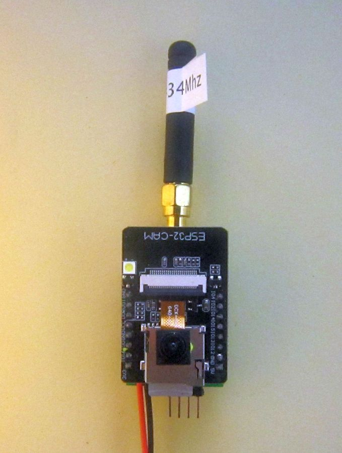
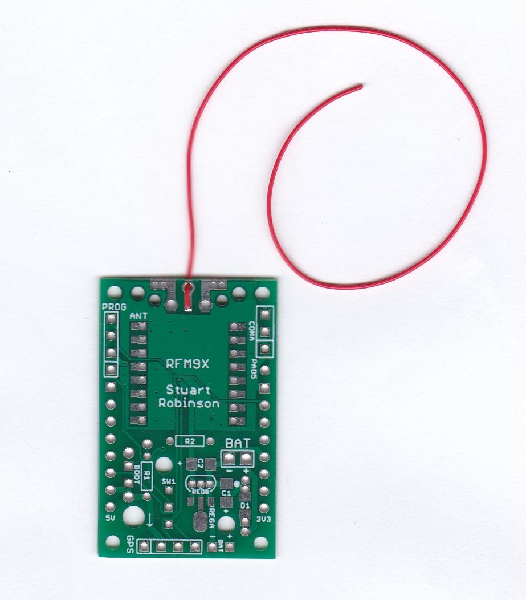
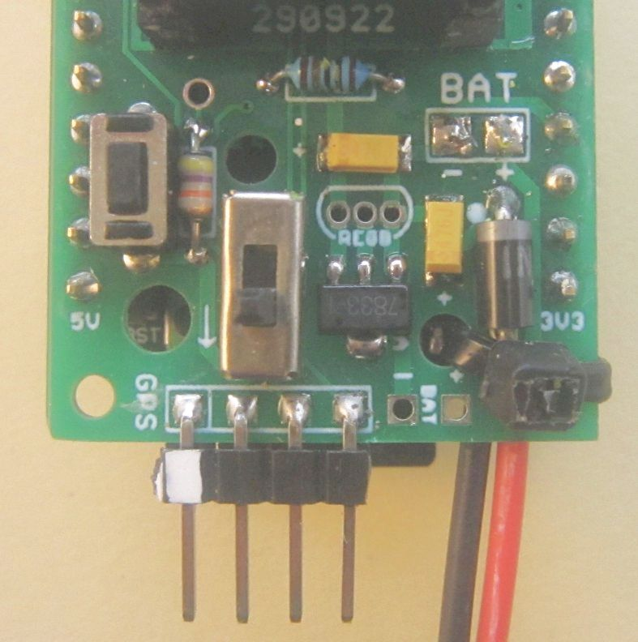
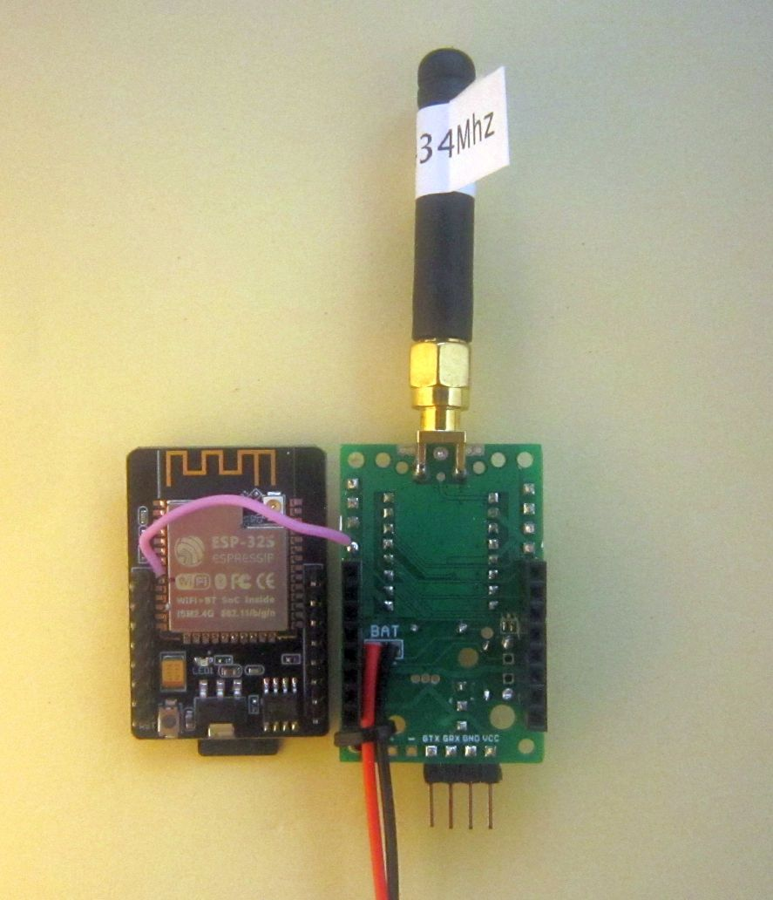

## Long Range Wireless Adapter board for ESP32CAM and RFM9x

Described here is a circuit board only that can be used to connect a Hope RFM9X LoRa radio module to the ESP32CAM. The only parts supplied are the bare PCB and two 8 pin header sockets for plugging the ESP32CAM in. You will need reasonable soldering skills to assemble this board. 

The ESP32CAM is a low cost Micro controller with a camera, micro SD card socket, WiFi and Bluetooth.  The LoRa module will allow the transfer of the images taken by the ESP32CAM over very much longer distances that would be possible with WiFi or Bluetooth. 

 

  

 

This is the list of parts you will need to buy;

- 4 pin 0.1" pin header for programming connection
- 3 pin 0.1" pin header for Serial2 monitor connection
- JST battery lead
- Tie wrap for battery lead
- SMA antenna socket
- Antenna wire, 17cm for 434Mhz, 8.6cm for 868Mhz
- Pin 33 wire, silicone.
- Boot switch

Optional

- IN5817 Diode
- MCP1702 or HT7833 Regulator
- 47K 125mW resistor
- 100K 125mW resistor
- 2 off 47uF 10V min 1206 tantalum capacitor

The programs require the use of the ESP32 GPIO pin that normally drives the White LED, so there is a modification required for the ESP32CAM to remove the LED driver transistor, its described later. 

With this board used as an image transmitter there needs to be another Arduino with a matching LoRa module connected to act as the receiver. The received images are saved as a file on an SD card. Another Long Range Wireless Adapter board with an ESP32CAM board can act as the receiver.

In addition to saving the transmitted images to the SD card, there is a version of the receiver program that can transfer the images via the normal program Serial upload port to a folder on a connected PC.

The assembled board looks like this;

 

  

 

 

  

 

### Build Options for Long Range Wireless Adapter

This board, numbered 071023 is for a Hope RFM9x LoRa module which is normally soldered direct onto the top of the PCB. You can use 2mm spacing pin headers if you wish. The previous version of the board, 290922, was modified in October 2023 to remove the connection on the board of the GND pin next to the UOT pin on the ESP32CAM. On some newer ESP32CAM boards this pin is now connected to EN\RESET so it should not be connected to GND as before.

**Essential:** Before you even attempt to use the Long Range Wireless Adapter board first check that your ESP32CAM is **fully working** and can save pictures to the chosen SD card. There is an excellent tutorial on how to do this here;

[**https://randomnerdtutorials.com/esp32-cam-take-photo-save-microsd-card**](https://randomnerdtutorials.com/esp32-cam-take-photo-save-microsd-card)

Do not proceed to assemble the Long Range Wireless Adapter until you are **really really** sure your ESP32CAM is fully working. 

**Note:** You may need to remove the SD card to program the ESP32CAM.

For a minimal working set-up you need to do the following;

1 Solder the 2 x 8 pin header sockets in place. You can for a lower profile assembled unit solder the ESP32CAM pins directly to the PCB, your choice.

2 Solder a 4 pin 0.1" header in place for the FTDI program upload connector. This connector is labelled 'PROG' on the PCB.

3 Fit an PCB edge mount SMA antenna connector and screw in an antenna or use a 17.3cm length of wire for an 433Mhz LoRa module or 8.6cm for an 868Mhz module. **Do not under any circumstances operate the LoRa module without an antenna connected**. 

For the wire antenna I normally use PTFE insulated wire, its stiff for its size and low friction so less likely to catch and snap. Its fitted as in the picture below, soldered to the top centre pad of the antenna and fed through the hole on the board edge.

 

  

 

4 Fit a switch that connects DIO0 to GND for programming. Its labelled 'BOOT'. You can use a 2 pin 0.1" pin header and shorting link if you dont have a switch.

5 Connect two wires to the battery connector near the RFM9x, its labelled 'BAT' and secure the leads with a zip tie. Or fit an angled pin header at the bottom of the PCB, those pins are labelled 'BAT' too.

6 Space is provided on the PCB for a battery reverse protection diode, D1(IN5817) or fuse FS1 (Polyfuse circa 250mA). If you don't want to fit either the diode or the fuse fit a wire link at the D1\FS1 location. The Cathode end of the diode, normally marked on the diode as a white band, goes at the connection marked with a white dot on the PCB.  

7 Remove the transistor driving the GPIO4 White LED, circled in red in the picture below;

 

  

 

8 Solder your RFM95 in place. This can either be soldered SMT style or you can get 2mm spacing pin headers and use them to solder the RFM95 in place. Note the RFM95 has a pin labeled 'ANT' on the back, this pin goes nearest the antenna connection on the PCB. 

That's all that's needed to get the Long Range Wireless Adapter working. The ESP32CAM and RFM9x LoRa module will then be powered by the ESP32CAMs AMS1117 3.3V regulator. A battery pack of 4xAA batteries good for this setup.

### Programming the ESP32CAM on the Long Range Wireless Adapter

Connect a USB to serial adapter to the 4 pin header at the antenna end of the Long Range Wireless Adapter PCB, the wiring is shown below, pin 1 is the pin furthest away from the antenna end of the PCB. The pinouts are in the same order if you were programming an Arduino Pro Mini, see the provided schematic.

With the Boot switch on the Long Range Wireless Adapter board held down if you press and release the Reset button on the ESP32CAM you should see the 'waiting for download' message in the Arduino IDE (set to 115200 baud). 

    rst:0x1 (POWERON_RESET),boot:0x3 (DOWNLOAD_BOOT(UART0/UART1/SDIO_REI_REO_V2))
    waiting for download

**Note:** You may need to remove the SD card to program the ESP32CAM.

If the ESP32CAM is mounted via the 0.1" header sockets there is room to press the ESP32CAM reset button with your finger or a flat bladed screwdriver. Otherwise there is a hole in the PC to allow a rod to be inserted to press the reset switch.

A bamboo skewer is also about the right diameter for this.

### Checking its working 

You will have previously tested the ESP32CAM is fully working so all that is now needed is a few simple checks to see if you can upload programs and run programs on the assembled board. 

Load program **1\_LED\_Blink** into the Arduino IDE. Press and hold the boot pin switch and then press the reset switch on the ESP32CAM. There is a hole in the Long Range Wireless Adapter board to push a rod through and access the reset switch that way.

With **1\_LED\_Blink** running you should see the ESP32CAM pin 33 red LED flashing, there is a hole in the PCB to allow it to be seen. If the White LED is flashing, that's not good,**you did not follow the instruction above to disable it.**

Next load up and run program **2\_ESP32CAM\_DeepSleep\_Test**. This program should print a message in the Serial monitor saying that the  LoRa device was found;

	LoRa device found

The program will then flash the red LED and go into a deep sleep for 30 seconds. If the ESP32CAM is battery powered with the original ESP32CAM AMS1117 regulator fitted this current is 3mA or so when the SD is fitted and 1.3mA when the optional MCP1702 or HT7833 regulator is fitted. The advantage of the MCP1702 is that at the operating current the drop-out voltage is only about 100mV so operation from a voltage supply of circa 3.4V is possible. The AMS1117 as fitted on the ESP32CAM has a drop-out voltage that could be as high as 1000mV, making low voltage operation problematic. If the supply\battery input voltage is more than 6.5V use an MCP1702 regulator(max input volts 13.2V) otherwise you could use an MCP1700 (max input volts 6.5V)

You now need to load the **3\_ESP32CAM\_Transmit\_Picture** program that will transmit the images taken. To receive the images you can use a second Long Range Wireless Adapter and ESP32CAM running program **4\_ESP32CAM\_Receive\_Picture**. 

As and alternative the **[SX12XX](https://github.com/StuartsProjects/SX12XX-LoRa)** library does have another program that will receive the transmitted image and save it to SD; **234\_SDfile\_Transfer\_Receiver** which typically is run on an Arduino DUE. 

Both the transmitter and receiver programs will show the progress of the picture taking and transfer process on the Arduino IDE Serial monitor.

### Low power options

If you remove the ESP32CAMs AMS1117 regulator, with a soldering iron or very carefully with a fine pair of wire cutters you can fit the Long Range Wireless Adapter board with a low drop-out voltage regulator which would then allow operation from a single lithium battery or 3 x AA batteries. If your just going to be using the ESP32CAM with LoRa then an MCP1702 regulator will be OK, maximum input voltage 13.2v. If your also going to use the WiFi capability of the ESP32CAM then a HT7833 regulator is recommended, maximum input voltage 8.5v, it has a higher current capability (500mA) than the MCP1702 (250mA). You can fit a TO92 or SOT89 package regulator. If using the HT7833 regulator the fitting C1 and C2 (47uF 10V 1206 tantalum) is recommended also. Note that C1 and C2 must be fitted the right way around. The + end of the tantalum is normally marked with a dark bar on the diode and that goes at the end marked with a + on the PCB. With the AMS1117 replaced with the MCP1702 or HT7833 regulator and the SD card and camera removed, the sleep current of the board drops to circa 330uA.

See picture of the board fitted with an HT7833 regulator and the AMS1117 regulator removed below;

 

  

 

 

  

 

### Other optional components

Resistors R1 and R2 (125mW versions) can be fitted and it allows for reading the battery voltage. This might be useful if your also trying to use the Long Range Wireless Adapter as a GPS tracker with the GPS fitted to the 4 pin connector at the bottom of the PCB. There is a program **20\_Read\_Battery\_Voltage\_Calibrate** that can be used to check the calibration of the battery read. Once assembled you can disconnect R1 and R2 from the circuit by cutting the track between the two pads of LK1 on the bottom of the PCB. If you have the second serial port working, see the '**Serial port for monitoring or progress messages**' section below, you can use the program **21\_GPS\_Echo** to copy characters received from your GPS to the second serial port so you can check its working. 

Note: The option of reading the battery voltage wont work with the SD card inserted, so with this option you wont be able to save images to the SD card. 

SW1 is a small switch that can e fitted which will disconnect the GPS, if fitted, temporarily from the UOR\RXD pin to allow program uploads to be carried out. if you cannot find a switch with the required 2mm pin spacing then a 0.1" pin header and jumper will just fit. For the GPS to operate the two bottom pins of the switch (nearest the GPS connector) need to be connected. To program the ESP32CAM either disconnect the GPS or remove the connection from the bottom two pins.  

### Picture File Uploads to PC

The image receive program receives the picture (from the remote ESP32CAM) as a series of segments and writes these into a memory array. When the transfer is finished this array is written as a file to the receivers SD card. This normally means that to see the images you need to remove the SD card from the ESP32CAM and read it in a tablet or PC etc. Whilst the SD card is out of the receiving ESP32CAM transfer of images is halted. 

To work around this issue it is possible to transfer the contents of the array as an image over the serial program upload port to an attached PC. The protocol used is YModem and its received on the PC with Tera Term, see setup instructions at the link below;

**[https://github.com/StuartsProjects/Devices/tree/master/YModem%20File%20Transfers%20to%20PC](https://github.com/StuartsProjects/Devices/tree/master/YModem%20File%20Transfers%20to%20PC)** 

### Serial port for monitoring or progress messages 

With the YModem file transfer to PC in use, the Serial port cannot now be used for the normal serial print of monitoring or progress messages to the Serial monitor.

The ESP32 does support two hardware serial ports and the pins for RX and TX can be directed to an available IO pin.   

There is a connector on the Long Range Wireless Adapter, its labelled CONA, which can be used to connect an additional serial to USB adapter. There is a pad, labelled PAD5, to enable the centre pin of the 3 pin connector to be connected to a spare IO pin on the ESP32CAM.

The only truly 'spare' pin on the ESP32CAM is GPIO pin 33 which drives the on-board red LED. You need to solder a short wire to pin 33 on the ESP32 module and then connect this wire to PAD1 on the Long Range Wireless Adapter board. The GND pin of CONA is at the end nearest to the DRF1278F, so connect this pin to the GND pin on the second USB to serial adapter and the centre pin of CONA to the RX pin on the USB to serial adapter. The pictures below show where the pin 33 wire is connected on the ESP32 module and where it connects to on the underside of the Long Range Wireless Adapter board.

 

  

 

 

  

 

Below is a picture of the connections for the GPIO pin 33 Serial port;

 

  

 

If you load up program **6\_ESP32CAM\_Receive\_Picture\_PCTransfer** that is set-up to use the normal programming Serial port for the YModem transfer and Serial2 (the GPIO pin 33 Serial port) for the monitor\debug messages.

If you can live without seeing the monitor\debug messages then there is no need for the pin 33 modification described above or the second USB to serial converter, the YModem transfer progress to the PC will work without them. The red LED on the ESP32CAM will flash when there is a transfer to the PC in progress.

The Serial2 monitor output (if you can see it) should display this for every completed transfer;

    YModem file transfer starting
    Waiting for receiver ping ...
    done
    Ymodem Sending TestFile.txt
    873 bytes
    ........done
    YModem transfer OK    

#### Please note:

**I am not, very definitely not,** in any way whatsoever an 'expert' on the ESP32CAM itself so will leave the task of refining the settings for taking pictures with and support of the ESP32CAM to others.

 

### Stuart Robinson

### March 2023
