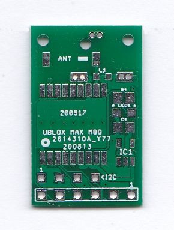

This GPS Breakout PCB is principally intended for use in high altitude balloon trackers. This is a board only, you will need to supply your own Ublox MAX M8Q GPS and other components. 

You can fit a a simple wire antenna, 1/4 wave == 4.76cm of 'ERNIE BALL CUSTOM GAUGE No.13 guitar wire'. There are also holes to allow the fitting of 4 x 1/4 wave ground plane radials. 

You can alternatively fit the often used ceramic stick antenna ,JTI_ANTENNA-1575AT43A40, but it does not seem to perform as well as the simple wire antenna. 

The MAX M8Q GPS supports both serial and I2C connections so the 6 pin edge connector has the I2C connections as well as the serial. There is then the option of fitting an I2C TC74 temperature sensor, IC1. There is also a 4 pin I2C header to which a BMP280 or BME280 sensor breakout board can be fitted. 

The inductor can be fitted to protect the GPS antenna input from static damage. Its a 33nH inductor, Farnell part 242 4724, WURTH ELEKTRONIK part  744786133A.

You can also add an LED which flashes when the GPS has a fix. 